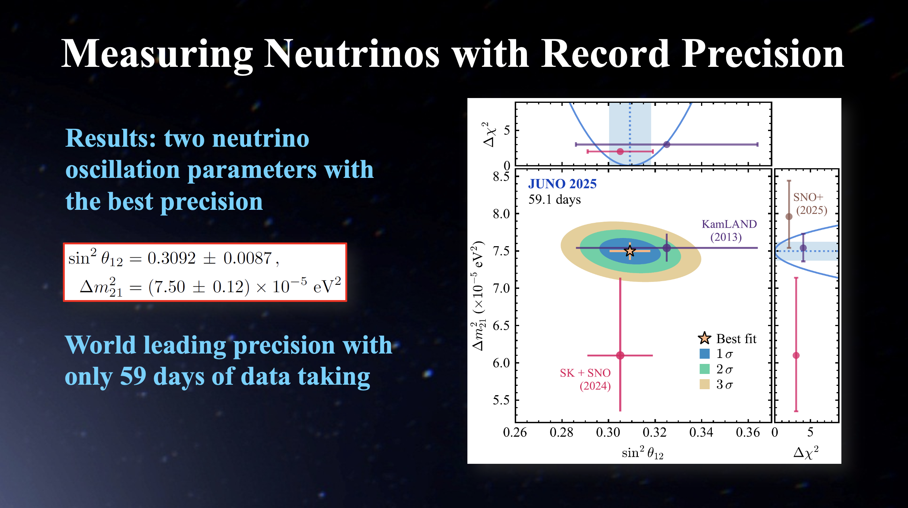



## Jiangmen Underground Neutrino Observatory (JUNO)

JUNO is a large-scale neutrino experiment located in Jiangmen, Guangdong Province, China. Its main design goal is to determine the neutrino mass ordering through precise measurements of reactor neutrino oscillations, while also probing new physics through the detection of supernova and solar neutrinos. The experiment is scheduled to begin data-taking in August 2025 and is expected to operate for approximately 30 years.

* Precision Measurements of Neutrino Oscillation Parameters

* Study of Supernova in the Era of Multi-Messenger Astronomy

* Diffuse Supernova Neutrino Background (or Supernova Relic Neutrinos)

* Introduction

* JUNO under construction in June 2023 

## Alpha Magnetic Spectrometer (AMS)

AMS is a multi-purpose high-energy particle detector installed on the International Space Station on May 19, 2011 to conduct a unique long-term mission of fundamental physics research in space. The primary physics objectives of AMS include the precise studies of the origin of dark matter, antimatter, and cosmic rays as well as the exploration of new phenomena.

I participated in both detector development and physics analysis for the AMS experiment. My work contributed to several key advances: I developed a new charge reconstruction method that improved the charge resolution of AMS by more than a factor of two, supporting the collaboration’s groundbreaking results in heavy cosmic ray nuclei. I led studies on the time evolution of cosmic rays, including crucial data analysis of protons and helium nuclei, which resulted in six AMS collaboration papers on solar physics (Physical Review Letters). I also led the analysis of the origin of lithium isotopes, which was published in Physical Review Letters and selected as an Editors’ Suggestion.
